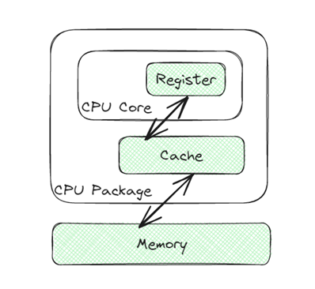
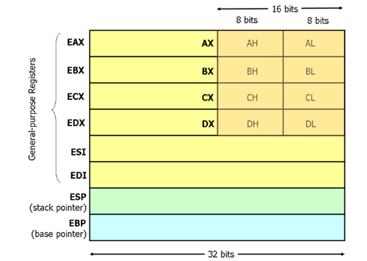
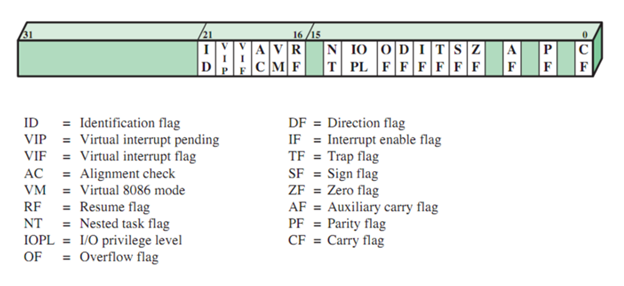
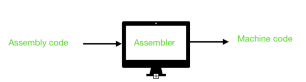
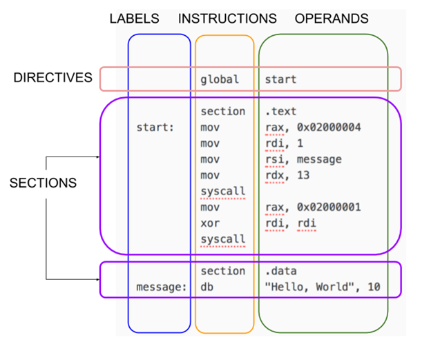

# Build Environment

## Bochs
**Bochs** is an open-source, portable x86 and x86-64 PC emulator and debugger, we use this to run our Linux kernel.

Install Bochs: https://bochs.sourceforge.io/, and add installation directory into Environment Variable.

Verify: run "`bochs`" in CMD.

## MSYS2
**Minimal SYStem 2 (MSYS2)** is a software distribution and development platform for Windows. It provides a Unix-like environment and a package management system that allows users to install and manage a variety of software tools and libraries typically found in Unix-like systems.

Install MSYS2: https://www.msys2.org/, and add "`msys64\mingw64\bin`" and "`msys64\usr\bin`" into Environment Variable.

### Required package
- **MinGW (Minimalist GNU for Windows)**: provides a set of tools, like gcc, g++, gdb, make.
- **Git**: a popular version control system, used to manage our code.
- **NASM (Netwide Assembler)**: is an open-source assembler for the x86 architecture.
- **Cmake**: is an open-source, cross-platform build system generator.

Install required packages: `pacman -S --needed base-devel mingw-w64-x86_64-toolchain git nasm cmake`

Verify: run "`nasm -v`", "`git -v`", "`cmake --version`" and "`gcc -v`" in CMD.

## VS Code
**Microsoft Visual Studio Code (VS Code)** is a free, open-source, and highly extensible code editor.

Install VS Code: https://code.visualstudio.com/download

Suggested Extensions:
- **Hex Editor**: used to read/write binary file

 
 

# X86 Register
Processor operations mostly involve processing data. 

To speed up the processor operations, the processor includes some internal memory storage locations, called **registers**.

 

In IA-32 architecture, registers are grouped into 3 categories:
- General Registers
- Control Registers
- Segment Registers

## General Registers
**32-bit data registers** used for arithmetic, logical, and other operations.
- **EAX** (Accumulator): store return value.
- **EBX** (Base): general-purpose use.
- **ECX** (Counter): store the loop count in iterative operations.
- **EDX** (Data): arithmetic operations.

**32-bit pointer registers**
- **ESP** (Stack Pointer): store the offset address of the stack’s top.
- **EBP** (Stack Base Pointer): store the offset address of the stack’s base.

**32-bit index registers** used for indexed addressing.
- **ESI** (Source Index): point to the source address of string operations.
- **EDI** (Destination Index): point to the destination address of string operations.

## Control Registers
**EIP** (Instruction Pointer): store the offset address of the next instruction to be executed.

32-bit **EFLAGS** register contains the status of an x86 CPU.

## Segment Registers
Segments are specific areas defined in a program for containing data, code and stack:
- **CS** (Code Segment): contains all the instructions to be executed.
- **DS** (Data Segment): contains data, constants, and work areas.
- **SS** (Stack Segment): contains data and return addresses of procedures or subroutines.

 
 

# Assembler

Assembler is a program for converting instructions written in low-level assembly code into relocatable machine code.

 
Some popular assemblers:
- **NASM** (Netwide Assembler) is widely used in the Linux and open-source software development community. It has simple and clean syntax.

- **MASM** (Microsoft Macro Assembler) is primarily used for Windows development.

- **GAS** (GNU Assembler) is the assembler used in GNU Compiler Collection (GCC). It is known for its AT&T-style syntax.

## NASM syntax
NASM is line-based. Most programs consist of directives followed by one or more sections. 

Lines can have an optional label. Most lines have an instruction followed by zero or more operands.

Reference: https://www.nasm.us/doc/
