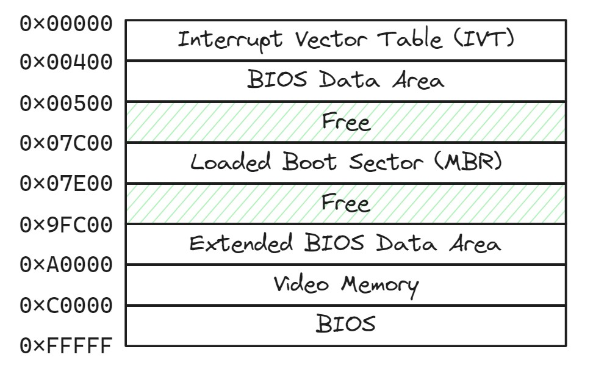
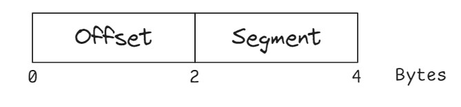
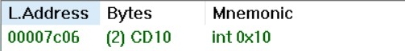
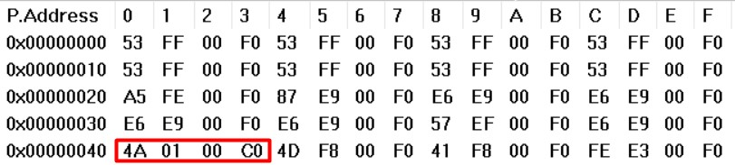
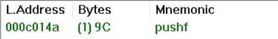
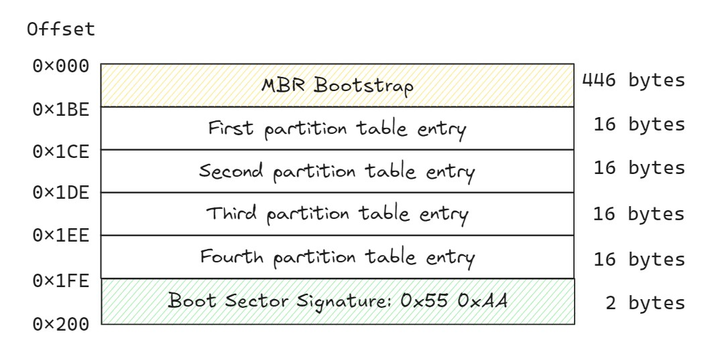
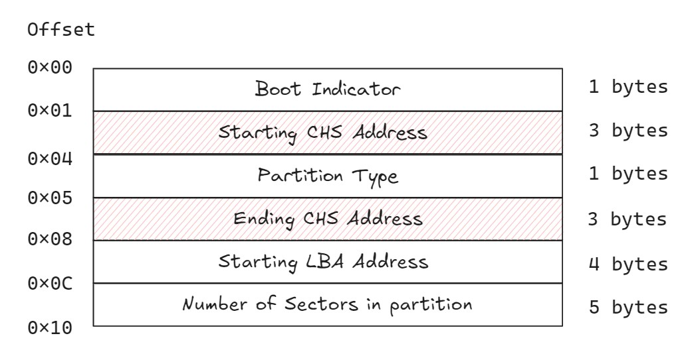

# The BIOS

**Basic Input/Output System (BIOS)** is a firmware component of a computer system that initializes and tests hardware components during the boot process and provides runtime services for operating systems and programs.

In x86 architecture, processors begin executing BIOS code in Real Mode after computer power on.

## Real Mode

It is a simplistic 16-bit mode that is present on all x86 processors.

Real Mode was the first x86 mode design and was used by many early operating systems before the birth of Protected Mode. For compatibility purposes, all x86 processors begin execution in Real Mode.

All the registers are 16-bit (like AX, BX), memory address are 20 bits, present by "Segment : Offset" (Physical Address = Segment << 4 + Offset)

## BIOS Process
1. Initialize and test the hardware, also called **POST (Power On Self Test)**
2. Load IVT to RAM
3. Load Boot Sector (MBR, the first sector in the storage device) and pass control to it.

Once BIOS completed, memory layout becomes:

 
 

# IVT

The **Interrupt Vector Table (IVT)** is a data structure used in x86 architecture to store pointers to **interrupt service routines (ISRs)**.

The IVT consists of 256 consecutive entries (located in RAM from 0x0 to 0x3FF), each of which is a 4-byte pointer (2 bytes for the offset and 2 bytes for the segment) to the ISR.

## Interrupt workflow

See an example when the processor encounters the instruction "INT 10":

"10" indicates that the interrupt number is 0x10, so the ISR address can be found at memory address 0x40 (0x10 * 4).

According to the IVT entry structure, the first 2 bytes are the offset and the next 2 bytes are the segment. In this case, the offset is "0x014A" and the segment is "0xC000", so the memory address is 0xC014A (0xC000 << 4 + 0x014A).

Verify it in Bochs:

 
 

# MBR

**MBR (Master Boot Record)** is the first sector of the storage device and contains the MBR bootstrap code and a Partition Table.

## Bootstrap

The MBR is loaded by the BIOS at physical address 0x7c00. The BIOS then jumps to the start of the loaded MBR (0x7c00) because this section of the MBR contains the “bootstrap” executable code.

Typical MBR bootstrap code performs the following tasks:

- **Initialization**: Sets up the environment and prepares for the boot process.
- **Parsing the Partition Table**: Reads and interprets the Partition Table in the MBR to determine the partition layout on the storage device.
- **Loading Bootloader (or OS)**: Based on the Partition Table information, it loads and transfers control to the specified bootloader or operating system boot sector.

## Layout

### Partition Table Layout

