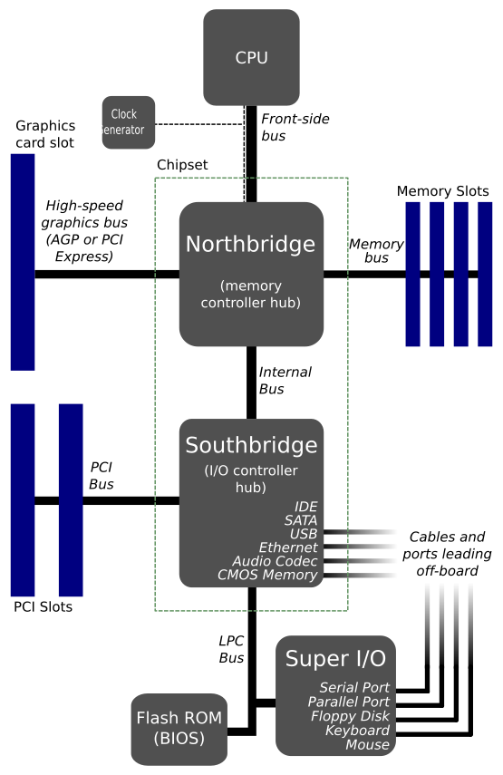
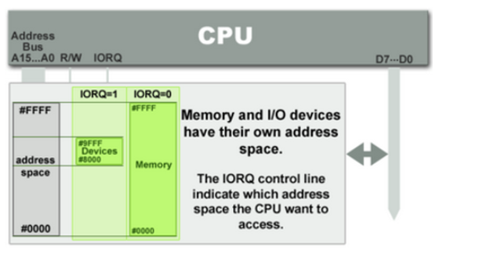
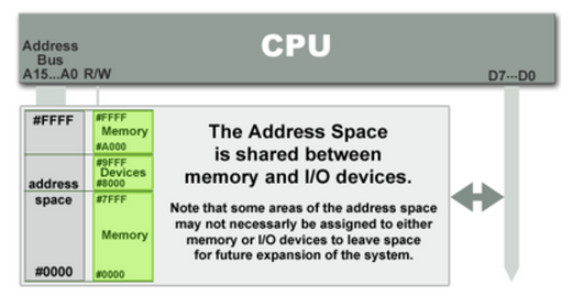
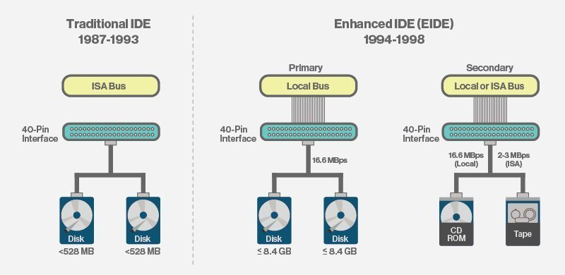

# Computer Architecture

Computer architecture has come a long way over the years to make computers faster, more efficient, and easier to use. 

Two key designs in this journey are the **North-South Bridge architecture** and the more modern **Platform Controller Hub (PCH) architecture**.

## North-South Bridge Architecture

This design was common in the 1990s and early 2000s. It used two main chips to connect the CPU to other parts of the computer:

- **North Bridge**: Handled fast connections between the CPU, RAM, graphics (AGP/PCIe), and the South Bridge.

- **South Bridge**: Managed slower devices like USB ports, hard drives (SATA), audio, and the system BIOS.

The North-South Bridge system wasn’t perfect. It was slower because data often had to take long routes ("hops") between the CPU and devices. It also created bottlenecks due to limited bandwidth and used a lot of power, generating heat.

## PCH Architecture

In the mid-2000s, the **Platform Controller Hub (PCH)** architecture came along to fix these issues by simplifying how everything connects. It consists of:

- **Integrated North Bridge**: The CPU now includes memory and PCIe controllers, so it can directly talk to RAM and high-speed devices like graphics cards.

- **PCH**: Took over the South Bridge’s job, managing USB, SATA, audio, and networking tasks.

With PCH architecture, everything works faster and more smoothly. The CPU can directly access important components like memory, reducing delays. There’s more bandwidth for peripherals, and the system design is simpler, using less power and producing less heat.

 
 

# I/O Communication

In computer systems, the CPU communicates with external devices using two main methods: **Port-mapped I/O (PMIO)** and **Memory-mapped I/O (MMIO)**. 

These methods differ in how I/O devices are accessed and addressed.

## Port-mapped I/O (PMIO) 

In PMIO, I/O devices are assigned a separate address space, and the CPU communicates with them using special instructions like `IN` and `OUT`. 

This approach simplifies hardware design by using fewer address lines but requires specialized instructions for I/O operations, making programming more complex and limited by the number of available ports in the address space.

## Memory-mapped I/O (MMIO)

In MMIO, I/O devices are mapped into the system's memory address space. The CPU interacts with these devices using standard memory instructions like `MOV`, simplifying programming. 

However, MMIO requires more complex hardware to decode the entire address space, and the system’s memory must be large enough to accommodate both memory and I/O devices.

Both methods have their benefits and are chosen based on factors like hardware complexity and programming ease.

## ATA device addressing with PMIO

ATA devices are connected to the I/O controller via the ATA bus, and the CPU can use PMIO to interact with and control their behavior.

 

An ATA bus typically has 10 I/O ports, which control various operations. For the primary ATA bus, these I/O ports usually range from 0x1F0 (the I/O port base) to 0x1F7.

Steps to Read Data from a Disk via the ATA Bus:
1. Write control information to the ports 0x1F2 to 0x1F7 using the `OUT` instruction.
2. Read from port 0x1F7 to check if the I/O device is ready.
3. Read data from port 0x1F0. If multiple sectors are needed, return to step 2.

Reference: https://wiki.osdev.org/ATA_PIO_Mode

