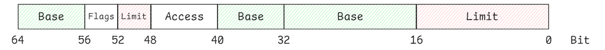

# Protected Mode

Protected mode introduced with the Intel 80286 processor in 1982, is a mode used by x86-compatible CPUs to help operating systems manage system resources securely and efficiently. It offers several key features:

1. **Segmentation**: Breaks memory into segments, making it easier to manage and protect.
2. **Paging**: Enables the system to use virtual memory by dividing memory into smaller pages, allowing programs to run as if they have access to more memory than physically available.
3. **Virtual Memory**: Programs can access continuous memory, even if it's spread across different physical locations, enabling the smooth running of larger applications.
4. **Safe Multitasking**: Allows the operating system to run multiple tasks at once without them interfering with each other, improving security and stability.

## Segmentation

**Segmentation** is a memory management technique that uses **segment selectors**, **segment descriptors**, and the **Global Descriptor Table (GDT)** to efficiently manage and protect memory. It enables the CPU to enforce access control, preventing unauthorized access to memory, thereby enhancing system security and stability.

### Segment Selector

In **real mode**, segment registers directly store the segment address, with the CPU calculating the physical address by shifting the segment value and adding the offset.

In **protected mode**, segment registers hold a segment selector which is a 16-bit structure that identifies a segment in either the **Global Descriptor Table (GDT)** or the **Local Descriptor Table (LDT)**.


- **Index (13 bits)**: Points to a specific segment entry in the GDT or LDT.
- **TI (1 bit)**: Indicates whether the segment resides in the GDT (TI = 0) or the LDT (TI = 1).
- **RPL (2 bits)**: The Request Privilege Level determines the required access level for using the segment (0 for kernel-level, 3 for user-level).

```asm
; Define code (index = 1) and data (index = 2) segment selectors for GDT with Ring 0 permission.

CODE_SELECTOR   equ     (1 << 3)
DATA_SELECTOR   equ     (2 << 3)
```

### GDTR Register

The GDTR register points to the GDT’s location in memory.


- **Offset (32 bits)**: The base address of the GDT in memory.
- **Size (16 bits)**: The size of the GDT in bytes, stored as the number of bytes minus one.

This allows the CPU to reference the segments defined in the GDT.


### Global Descriptor Table (GDT)

The Global Descriptor Table (GDT) is a key structure in protected mode that stores segment descriptors, which define the properties of each memory segment. 

Each entry in the GDT is 8 bytes long, providing detailed information about a segment. The first entry in the GDT is always null to prevent invalid segment references.


### Segment Descriptors in GDT

Each GDT entry is a segment descriptor that includes important details about a segment:



- **Base Address (32 bits)**: Specifies the starting address of the segment in memory.
- **Limit (20 bits)**: Defines the segment's maximum size, setting the range of accessible memory.
- **Flags (4 bits)**:

    

    - **G (Granularity)**: Specifies whether the segment limit is in bytes (0) or pages (1).
    - **DB (Size)**: Indicates 16-bit (0) or 32-bit (1) segments.
    - **L (Long Mode Code)**: Marks the segment as a 64-bit code segment if set.
    - **R (Reserved)**: Always 0.
- **Access Rights (8 bits)**: Specifies access permissions:

    

    - **P (Present)**: Indicates if the segment is valid.
    - **DPL (Descriptor Privilege Level)**: Sets the privilege level (0 for kernel, 3 for user).
    - **S (Descriptor Type)**: Distinguishes between system (0) and code/data (1) segments.
    - **E (Executable)**: Marks the segment as executable (1 for code segments).
    - **DC (Direction/Conforming)**:
        - Data segment (Direction): 0 for grow up (like heap segment), 1 for grow down (like stack segment).
        - Code segment (Conforming): 0 for code in this segment can only be executed from the ring set in DPL, 1 for code in this segment can be executed from an equal or lower privilege level.
    - **RW (Readable/Writable)**: Defines if the segment is readable (1 for code) or writable (1 for data).
    - **A (Accessed)**: Shows if the segment has been accessed.
```nasm
; GDT table

SEG_BASE    equ     0
SEG_LIMIT   equ     0xfffff

; Entry 0 - NULL Segment Descriptor
gdt_base:
        dd 0, 0

; Entry 1 - Code Segment Descriptor
gdt_code:
        dw SEG_LIMIT & 0xffff
        dw SEG_BASE & 0xffff
        db (SEG_BASE >> 16) & 0xff
        db 0b1_00_1_1_0_0_0
        db ((SEG_LIMIT >> 16) & 0xf) | 0b0_1_0_0_0000
        db SEG_BASE >> 24 & 0xff

; Entry 2 - Data Segment Descriptor
gdt_data:
        dw SEG_LIMIT & 0xffff
        dw SEG_BASE & 0xffff
        db (SEG_BASE >> 16) & 0xff
        db 0b1_00_1_0_0_1_0
        db ((SEG_LIMIT >> 16) & 0xf) | 0b1_1_0_0_0000
        db SEG_BASE >> 24 & 0xff

; GDTR Register content
gdtr_val:
    dw $ - gdt_base - 1      ; 16-bit word for GDT size (size of GDT - 1)
    dd gdt_base              ; 32-bit double word for the base address of GDT
```   

### Addressing in Protected Mode

Addressing in protected mode involves two steps, often expressed as `Segment Selector : Offset`


1. The "index" is extracted from the Segment Selector, and the "offset" is obtained from the GDTR register. The address of the segment descriptor in the GDT is calculated as:

    `Segment Descriptor Address = GDTR Offset + (Index * 8)`

2. The CPU retrieves the "Base" value from the segment descriptor and adds the "offset" to calculate the linear address. If paging is disabled, this linear address becomes the physical memory address:

    `Physical Address = Base + Offset`