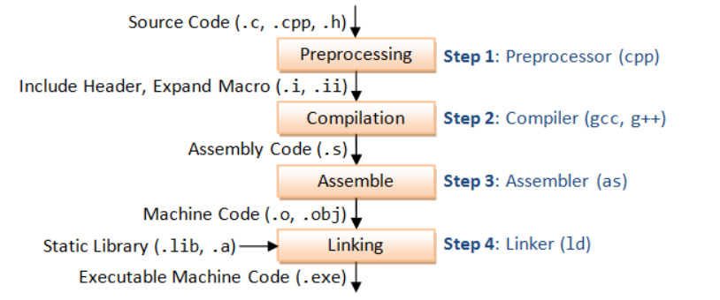

# Compilation in C

In the previous part of our project, all code was written in NASM. Now, we will transition to using C. While NASM and C are different programming languages, they both ultimately generate machine instructions, enabling a seamless switch between them.

To understand this transition, let’s explore the steps involved in converting C source code into machine-readable code. This process consists of several distinct phases, each playing a specific role:



## 1. Preprocessing

The preprocessor handles all directives starting with `#`. This phase includes:

- **Removing Comments**: Stripping out all comments from the source code.

- **Expanding Macros**: Replacing macro definitions with their actual values.

- **Including Header Files**: Inserting the contents of header files specified by #include.

- **Conditional Compilation**: Compiling only the code blocks that satisfy conditional directives.

```console
$ cat file.c
#define NUM 10

int main(){
    int i = 10 + NUM;
    return i;
}

$ gcc -E file.c -o file.i

$ cat file.i
# 1 "file.c"
# 1 "<built-in>"
# 1 "<command-line>"
# 31 "<command-line>"
# 1 "/usr/include/stdc-predef.h" 1 3 4
# 32 "<command-line>" 2
# 1 "file.c"


int main(){
 int i = 10 + 10;
 return i;
}
```

## 2. Compilation

The compiler validates the syntax and structure of the preprocessed code. 

If no errors are found, it generates assembly code, which is a human-readable representation of machine instructions.

```console
$ gcc -S file.c -o file.s

$ cat file.s
    .file   "file.c"
    .text
    .globl  main
    .type   main, @function
main:
.LFB0:
    .cfi_startproc
    pushq   %rbp
    .cfi_def_cfa_offset 16
    .cfi_offset 6, -16
    movq    %rsp, %rbp
    .cfi_def_cfa_register 6
    movl    $20, -4(%rbp)
    movl    -4(%rbp), %eax
    popq    %rbp
    .cfi_def_cfa 7, 8
    ret
    .cfi_endproc
.LFE0:
    .size   main, .-main
    .ident  "GCC: (GNU) 8.5.0 20210514 (Red Hat 8.5.0-4)"
    .section        .note.GNU-stack,"",@progbits

```

## 3. Assembly

The assembler takes the assembly instructions from the `.s` file and translates them into machine-level object code. This object file is relocatable and contains machine instructions but unresolved references (e.g., function calls).

```console
$ gcc -c file.s -o file.o

$ file file.o
file.o: ELF 64-bit LSB relocatable, x86-64, version 1 (SYSV), not stripped
```

## 4. Linking

The linker combines object files and resolves all references to produce an executable file. It links library functions, such as `printf`, and adds any necessary startup and cleanup code.

```console
$ gcc file.o -o file

$ file file
file: ELF 64-bit LSB executable, x86-64, version 1 (SYSV), dynamically linked, interpreter /lib64/ld-linux-x86-64.so.2, for GNU/Linux 3.2.0, BuildID[sha1]=7710b19045f04d71dfd9382511c8d8084bc26c98, not stripped
```