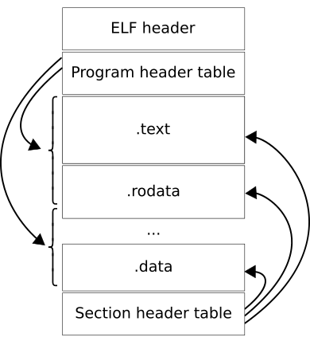

# Compilation in C

In the previous part of our project, all code was written in NASM. Now, we will transition to using C. While NASM and C are different programming languages, they both ultimately generate machine instructions, enabling a seamless switch between them.

To understand this transition, let’s explore the steps involved in converting C source code into machine-readable code. This process consists of several distinct phases, each playing a specific role:


## 1. Preprocessing

The preprocessor handles all directives starting with `#`. This phase includes:

- **Removing Comments**: Stripping out all comments from the source code.

- **Expanding Macros**: Replacing macro definitions with their actual values.

- **Including Header Files**: Inserting the contents of header files specified by #include.

- **Conditional Compilation**: Compiling only the code blocks that satisfy conditional directives.

```console
$ cat file.c
#define NUM 10

int main(){
    int i = 10 + NUM;
    return i;
}

$ gcc -E file.c -o file.i

$ cat file.i
# 1 "file.c"
# 1 "<built-in>"
# 1 "<command-line>"
# 31 "<command-line>"
# 1 "/usr/include/stdc-predef.h" 1 3 4
# 32 "<command-line>" 2
# 1 "file.c"


int main(){
 int i = 10 + 10;
 return i;
}
```

## 2. Compilation

The compiler validates the syntax and structure of the preprocessed code. 

If no errors are found, it generates assembly code, which is a human-readable representation of machine instructions.

```console
$ gcc -S file.c -o file.s

$ cat file.s
    .file   "file.c"
    .text
    .globl  main
    .type   main, @function
main:
.LFB0:
    .cfi_startproc
    pushq   %rbp
    .cfi_def_cfa_offset 16
    .cfi_offset 6, -16
    movq    %rsp, %rbp
    .cfi_def_cfa_register 6
    movl    $20, -4(%rbp)
    movl    -4(%rbp), %eax
    popq    %rbp
    .cfi_def_cfa 7, 8
    ret
    .cfi_endproc
.LFE0:
    .size   main, .-main
    .ident  "GCC: (GNU) 8.5.0 20210514 (Red Hat 8.5.0-4)"
    .section        .note.GNU-stack,"",@progbits

```

## 3. Assembly

The assembler takes the assembly instructions from the `.s` file and translates them into machine-level object code. This object file is relocatable and contains machine instructions but unresolved references (e.g., function calls).

```console
$ gcc -c file.s -o file.o

$ file file.o
file.o: ELF 64-bit LSB relocatable, x86-64, version 1 (SYSV), not stripped
```

## 4. Linking

The linker combines object files and resolves all references to produce an executable file. It links library functions, such as `printf`, and adds any necessary startup and cleanup code.

```console
$ gcc file.o -o file

$ file file
file: ELF 64-bit LSB executable, x86-64, version 1 (SYSV), dynamically linked, interpreter /lib64/ld-linux-x86-64.so.2, for GNU/Linux 3.2.0, BuildID[sha1]=7710b19045f04d71dfd9382511c8d8084bc26c98, not stripped
```

# Executable and Linkable Format (ELF)

When we assemble NASM code into a flat binary file, the resulting file typically contains only two segments: the text (code) and data segments. This simple structure works well in the virtual machine, such as Bochs. However, modern operating systems require a more sophisticated file format to manage executables.

The **ELF (Executable and Linkable Format)** is a standard file format used for executable files, object code, shared libraries, and core dumps in Unix-based systems. It addresses several critical limitations of flat binary files by offering key features:

- **Metadata and Flexibility**: ELF files contain headers that define the file’s memory layout, permissions, and entry points. They also include relocation tables, which allow dynamic memory adjustments during loading, offering greater flexibility.

- **Support for Dynamic Linking**: ELF supports dynamic linking, meaning that external libraries are resolved at runtime. This reduces the size of executables and allows for easier updates to shared libraries without requiring the entire program to be recompiled.

- **Debugging and Diagnostics**: ELF files can store debug symbols and metadata, enabling powerful debugging tools like `gdb` and `readelf` to analyze and troubleshoot programs more effectively.

- **Enhanced Security**: ELF supports various memory protection mechanisms and modern security features such as **Address Space Layout Randomization (ASLR)**, which helps defend against memory-based attacks.

## ELF Layout

An ELF file is divided into three main components: **the ELF Header**, **Program Header Table (PHT)**, and **Section Header Table (SHT)**.



### 1. The ELF Header
The ELF Header provides essential information, including the file type, architecture, entry point, and pointers to the Program and Section Header Tables.

```console
$  readelf -h file
ELF Header:
  Magic:   7f 45 4c 46 02 01 01 00 00 00 00 00 00 00 00 00
  Class:                             ELF64
  Data:                              2's complement, little endian
  Version:                           1 (current)
  OS/ABI:                            UNIX - System V
  ABI Version:                       0
  Type:                              EXEC (Executable file)
  Machine:                           Advanced Micro Devices X86-64
  Version:                           0x1
  Entry point address:               0x400450
  Start of program headers:          64 (bytes into file)
  Start of section headers:          15496 (bytes into file)
  Flags:                             0x0
  Size of this header:               64 (bytes)
  Size of program headers:           56 (bytes)
  Number of program headers:         9
  Size of section headers:           64 (bytes)
  Number of section headers:         28
  Section header string table index: 27
```

### 2. The Program Header Table (PHT)
The Program Header Table defines how the ELF file is loaded into memory, specifying segment types (e.g., LOAD), memory addresses, permissions (e.g., read, write, execute), size, and alignment.

```console
$ readelf -l file

Elf file type is EXEC (Executable file)
Entry point 0x400450
There are 9 program headers, starting at offset 64

Program Headers:
  Type           Offset             VirtAddr           PhysAddr
                 FileSiz            MemSiz              Flags  Align
  PHDR           0x0000000000000040 0x0000000000400040 0x0000000000400040
                 0x00000000000001f8 0x00000000000001f8  R      0x8
  INTERP         0x0000000000000238 0x0000000000400238 0x0000000000400238
                 0x000000000000001c 0x000000000000001c  R      0x1
      [Requesting program interpreter: /lib64/ld-linux-x86-64.so.2]
  LOAD           0x0000000000000000 0x0000000000400000 0x0000000000400000
                 0x00000000000006e0 0x00000000000006e0  R E    0x200000
  LOAD           0x0000000000000e40 0x0000000000600e40 0x0000000000600e40
                 0x00000000000001dc 0x00000000000001e0  RW     0x200000
  DYNAMIC        0x0000000000000e50 0x0000000000600e50 0x0000000000600e50
                 0x0000000000000190 0x0000000000000190  RW     0x8
  NOTE           0x0000000000000254 0x0000000000400254 0x0000000000400254
                 0x0000000000000044 0x0000000000000044  R      0x4
  GNU_EH_FRAME   0x00000000000005e8 0x00000000004005e8 0x00000000004005e8
                 0x0000000000000034 0x0000000000000034  R      0x4
  GNU_STACK      0x0000000000000000 0x0000000000000000 0x0000000000000000
                 0x0000000000000000 0x0000000000000000  RW     0x10
  GNU_RELRO      0x0000000000000e40 0x0000000000600e40 0x0000000000600e40
                 0x00000000000001c0 0x00000000000001c0  R      0x1

 Section to Segment mapping:
  Segment Sections...
   00
   01     .interp
   02     .interp .note.ABI-tag .note.gnu.build-id .gnu.hash .dynsym .dynstr .gnu.version .gnu.version_r .rela.dyn .init .text .fini .rodata .eh_frame_hdr .eh_frame
   03     .init_array .fini_array .dynamic .got .got.plt .data .bss
   04     .dynamic
   05     .note.ABI-tag .note.gnu.build-id
   06     .eh_frame_hdr
   07
   08     .init_array .fini_array .dynamic .got
```

### 3. The Section Header Table (SHT)
The Section Header Table describes the sections in the ELF file (e.g., .text, .data, .bss), their sizes, offsets, and properties like whether they are writable or executable. It is mainly used during linking and debugging.

```console
$ readelf -S file
There are 28 section headers, starting at offset 0x3c88:

Section Headers:
  [Nr] Name              Type             Address           Offset
       Size              EntSize          Flags  Link  Info  Align
  [ 0]                   NULL             0000000000000000  00000000
       0000000000000000  0000000000000000           0     0     0
  [ 1] .interp           PROGBITS         0000000000400238  00000238
       000000000000001c  0000000000000000   A       0     0     1
  [ 2] .note.ABI-tag     NOTE             0000000000400254  00000254
       0000000000000020  0000000000000000   A       0     0     4
  [ 3] .note.gnu.build-i NOTE             0000000000400274  00000274
       0000000000000024  0000000000000000   A       0     0     4
  [ 4] .gnu.hash         GNU_HASH         0000000000400298  00000298
       000000000000001c  0000000000000000   A       5     0     8
  [ 5] .dynsym           DYNSYM           00000000004002b8  000002b8
       0000000000000078  0000000000000018   A       6     1     8
  [ 6] .dynstr           STRTAB           0000000000400330  00000330
       000000000000006e  0000000000000000   A       0     0     1
  [ 7] .gnu.version      VERSYM           000000000040039e  0000039e
       000000000000000a  0000000000000002   A       5     0     2
  [ 8] .gnu.version_r    VERNEED          00000000004003a8  000003a8
       0000000000000020  0000000000000000   A       6     1     8
  [ 9] .rela.dyn         RELA             00000000004003c8  000003c8
       0000000000000060  0000000000000018   A       5     0     8
  [10] .init             PROGBITS         0000000000400428  00000428
       000000000000001b  0000000000000000  AX       0     0     4
  [11] .text             PROGBITS         0000000000400450  00000450
       0000000000000175  0000000000000000  AX       0     0     16
  [12] .fini             PROGBITS         00000000004005c8  000005c8
       000000000000000d  0000000000000000  AX       0     0     4
  [13] .rodata           PROGBITS         00000000004005d8  000005d8
       0000000000000010  0000000000000000   A       0     0     8
  [14] .eh_frame_hdr     PROGBITS         00000000004005e8  000005e8
       0000000000000034  0000000000000000   A       0     0     4
  [15] .eh_frame         PROGBITS         0000000000400620  00000620
       00000000000000c0  0000000000000000   A       0     0     8
  [16] .init_array       INIT_ARRAY       0000000000600e40  00000e40
       0000000000000008  0000000000000008  WA       0     0     8
  [17] .fini_array       FINI_ARRAY       0000000000600e48  00000e48
       0000000000000008  0000000000000008  WA       0     0     8
  [18] .dynamic          DYNAMIC          0000000000600e50  00000e50
       0000000000000190  0000000000000010  WA       6     0     8
  [19] .got              PROGBITS         0000000000600fe0  00000fe0
       0000000000000020  0000000000000008  WA       0     0     8
  [20] .got.plt          PROGBITS         0000000000601000  00001000
       0000000000000018  0000000000000008  WA       0     0     8
  [21] .data             PROGBITS         0000000000601018  00001018
       0000000000000004  0000000000000000  WA       0     0     1
  [22] .bss              NOBITS           000000000060101c  0000101c
       0000000000000004  0000000000000000  WA       0     0     1
  [23] .comment          PROGBITS         0000000000000000  0000101c
       0000000000000058  0000000000000001  MS       0     0     1
  [24] .gnu.build.attrib NOTE             0000000000a01020  00001074
       0000000000001b90  0000000000000000           0     0     4
  [25] .symtab           SYMTAB           0000000000000000  00002c08
       0000000000000948  0000000000000018          26    80     8
  [26] .strtab           STRTAB           0000000000000000  00003550
       0000000000000628  0000000000000000           0     0     1
  [27] .shstrtab         STRTAB           0000000000000000  00003b78
       000000000000010f  0000000000000000           0     0     1
Key to Flags:
  W (write), A (alloc), X (execute), M (merge), S (strings), I (info),
  L (link order), O (extra OS processing required), G (group), T (TLS),
  C (compressed), x (unknown), o (OS specific), E (exclude),
  l (large), p (processor specific)
```