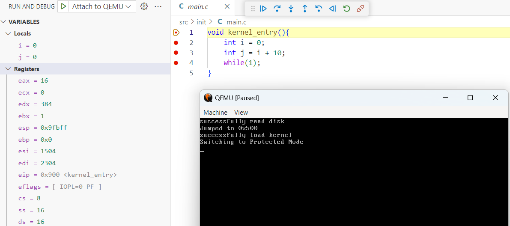

# GDB

A debugger is a program that runs other programs, allowing the user to exercise control over these programs and examine variables when problems arise. 

The **GNU Debugger (GDB)** is the most popular debugger for UNIX systems, widely used for debugging C and C++ programs. It provides several key features to help developers diagnose and resolve issues effectively:

- **Setting breakpoints**: Pause program execution at specific points.

- **Inspecting variables**: View and modify variable values during runtime.

- **Controlling execution**: Step through code line by line or execute until a condition is met.

- **Analyzing program crashes**: Understand segmentation faults or other unexpected behaviors.

- **Remote debugging**: Debug programs running on remote systems or embedded devices.

## Local Debugging

When a program is loaded into GDB, it reads the executable file to extract two main components:

- **Machine instructions**: The compiled binary code the CPU will execute.

- **Debugging symbols**: Additional information (if compiled with -g) that maps machine instructions to source code lines, variable names, and functions. Debugging symbols are stored in formats like DWARF or STABS.

GDB uses the `ptrace()` system call to:

- Pause and resume program execution.

- Inspect and modify memory.

- Handle signals, such as those triggered by breakpoints.

Also, Breakpoints are implemented by replacing the target instruction with a special `INT 3` instruction. 

- When the program hits the breakpoint, the CPU generates a trap signal (e.g., SIGTRAP).

- The operating system pauses the program and notifies GDB.

- GDB restores the original instruction by writing it back to the memory.

- GDB adjusts the program counter (EIP/RIP) to point back to the breakpoint’s address.

## Remote Debugging

Remote debugging is essential for scenarios where the program runs on a different machine, such as an embedded device, a virtual machine, or a remote server. GDB achieves this by splitting its functionality into two components:

- **GDB Server**: The program to be debugged is launched under the control of a GDB server (e.g., gdbserver) on the remote machine. The server listens for incoming connections, typically over a network socket.

- **GDB Client**: The developer runs GDB on their local machine and connects it to the remote server using the target remote command. Communication occurs over the GDB Remote Serial Protocol (RSP), which supports commands for setting breakpoints, reading/writing memory, inspecting registers, and controlling execution.

This setup allows developers to debug programs in resource-constrained environments or systems without direct access.

## Useful GDB Commands

Here are some essential GDB commands to get started:

- **run** or **r**: Executes the program from start to end.

- **break** or **b**: Sets a breakpoint on a particular line.

- **disable**: Disables a breakpoint.

- **enable**: Enables a disabled breakpoint.

- **next** or **n**: Executes the next line of code without diving into functions.

- **step**: Goes to the next instruction, diving into the function.

- **list** or **l**: Displays the code.

- **print** or **p**: Displays the value of a variable.

- **quit** or **q**: Exits out of GDB.

- **clear**: Clears all breakpoints.

- **continue**: Continues normal execution.

## Run GDB server in Qemu

Previously, we used Bochs to run and debug NASM programs. As we transition to C programming, QEMU becomes a more suitable choice for debugging due to its flexibility and built-in GDB server support.

### Setting Up Qemu

- Obtain Qemu from the official site: https://qemu.weilnetz.de/w64/

- Add Qemu installation directory to environment variables

- Set parameters in Makefile for debugging

    ```console
    # QEMU Options
    QEMU_FLAGS := -m 32M				# set guest startup RAM size
    QEMU_FLAGS += -hda ${HD_IMG_NAME}	# specify hard disk 0 image

    QEMU_DEBUG_FLAGS := -S				# do not start CPU at startup (you must type 'c' in the monitor)
    QEMU_DEBUG_FLAGS += -gdb tcp::6666	# accept a gdb connection on device
    ```

### Debugging in VS Code

- Install "Native Debug" from VS Code Extensions

- Configure remote GDB

  Navigate to the "Run and Debug" view and create a `launch.json` file by selecting "GDB: Connect to gdbserver"
    ```console
    # .vscode/launch.json
    {
        // Use IntelliSense to learn about possible attributes.
        // Hover to view descriptions of existing attributes.
        // For more information, visit: https://go.microsoft.com/fwlink/?linkid=830387
        "version": "0.2.0",
        "configurations": [
            {
                "type": "gdb",
                "request": "attach",
                "name": "Attach to QEMU GDB Server",
                "executable": "./build/kernel.pe",
                "target": "localhost:6666",
                "remote": true,
                "cwd": "${workspaceRoot}",
                "valuesFormatting": "parseText"
            }
        ]
    }
    ```
- Disable OSABI detection

    ```console
    # %USERPROFILE%\.gdbinit
    set osabi none
    ```

- Set breakpoints and debug

    