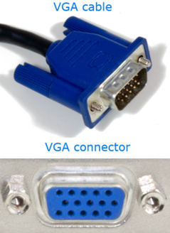
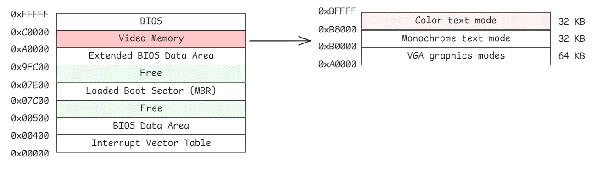
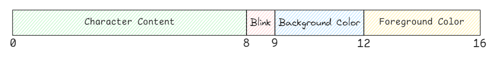
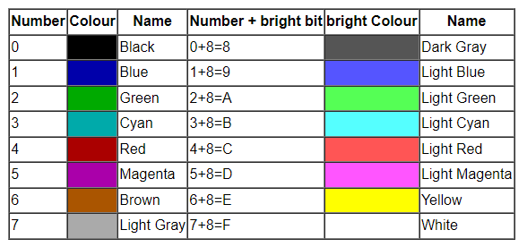
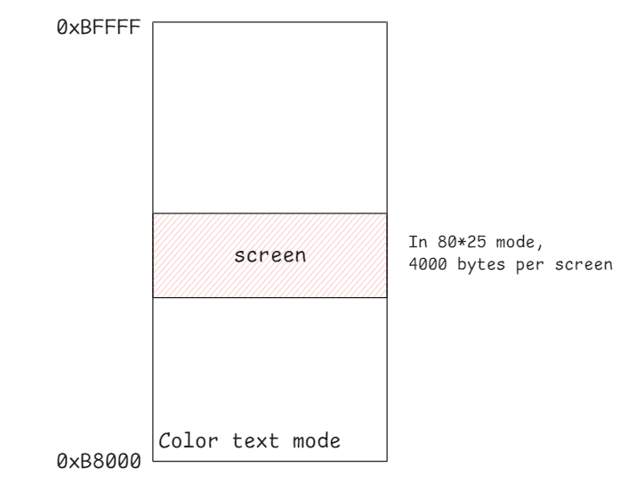
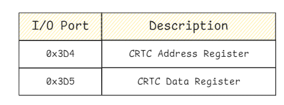
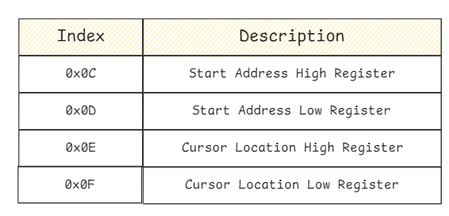

# VGA

**Video Graphics Array (VGA)** is a widely recognized **display standard** introduced by IBM in 1987. It utilizes analog signals, making it inherently limited to lower resolutions and display quality compared to modern digital interfaces. Despite these limitations, VGA has had a lasting impact and remains a foundational technology in computer graphics.



## VGA Text Mode

When a computer starts up, the BIOS initializes the VGA chip and sets it to operate in **text mode** by default. 

Text mode is a specialized VGA mode designed for rendering characters rather than graphical images. It is highly efficient for tasks like displaying system messages and console output during the boot process or within operating systems.

VGA implements several text modes, each defined by its resolution and font size:

- **80x25 text mode**: Characters are rendered using a 9x16 pixel font, resulting in an effective screen resolution of 720x400 pixels.

- **40x25 text mode**: Characters are rendered using a 9x16 pixel font, yielding a screen resolution of 360x400 pixels.

- **80x43 (or 80x50) text mode**: Characters are rendered using an 8x8 pixel font, producing a resolution of 640x344 (or 640x400) pixels.

### Text Buffer and Memory Mapping

In text mode, the VGA text buffer resides at the physical memory address `0xB8000`. This memory region is accessible in both real mode and protected mode. 

The CPU interacts with this buffer using **Memory-Mapped I/O (MMIO)**, allowing direct read and write operations to control the displayed content.



Each character on the screen is represented by 2 bytes in the text buffer:

- **Character Content**: The ASCII code of the character to be displayed.

- **Attribute Byte**: Specifies visual attributes such as:

    - **Blink Bit**: Can optionally enable blinking for the character or be used as an additional background color bit, 
    depending on the mode configuration.

    - **Background Color**: Sets the background color behind the character.

    - **Foreground Color**: Defines the color of the character itself.



The default color scheme configured by the BIOS during boot assigns the attribute byte 0x0F, where the background color is black (0x0) and the foreground color is bright white (0xF).




## Controlling VGA Behavior

VGA hardware includes a wide array of registers that control various aspects of its operation. These registers are accessed by the CPU through either PMIO or MMIO. 

We will focus on **CRT Controller (CRTC) registers**, as they control the display's screen start position and cursor location.



### CRT Controller (CRTC) Registers

The CRTC registers control how video data is output to the display and play a crucial role in configuring text mode displays.

CRTC registers are accessed indirectly using an index/data pair to overcome the limited I/O address space. 



The process involves setting an index to specify the desired register, then reading or writing data to that register.



### Example: Setting Screen Start and Cursor Position

```c
/* The CRT Controller (CRTC) Registers are accessed via a pair of registers. */
#define CRTC_ADDR_REG 0x3d4     /* CRTC Address Register */
#define CRTC_DATA_REG 0x3d5     /* CRTC Data Register */

#define START_ADDR_H 0xc        /* Start Address High Register (15-8 bit) */
#define START_ADDR_L 0xd        /* Start Address Low Register (7-0 bit) */

#define CURSOR_LOC_H 0xe        /* Cursor Location High Register (15-8 bit) */
#define CURSOR_LOC_L 0xf        /* Cursor Location Low Register 7-0 bit) */

/* set screen start location */
static void set_screen(u16 screen){
    outb(CRTC_ADDR_REG, START_ADDR_H);
    outb(CRTC_DATA_REG, screen >> 8);
    outb(CRTC_ADDR_REG, START_ADDR_L);
    outb(CRTC_DATA_REG, screen);
}

/* set cursor location */
static void set_cursor(u16 cursor){
    outb(CRTC_ADDR_REG, CURSOR_LOC_H);
    outb(CRTC_DATA_REG, cursor >> 8);
    outb(CRTC_ADDR_REG, CURSOR_LOC_L);
    outb(CRTC_DATA_REG, cursor);
}
```