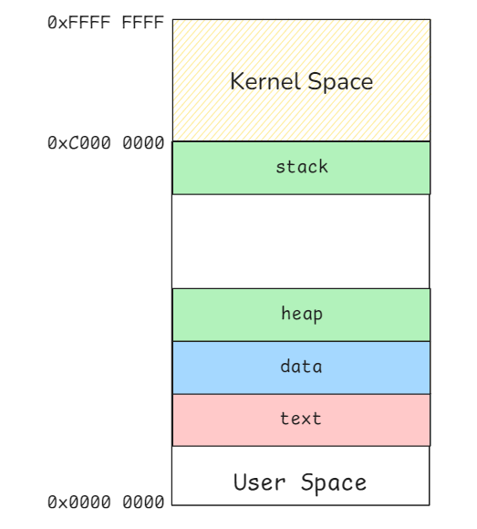
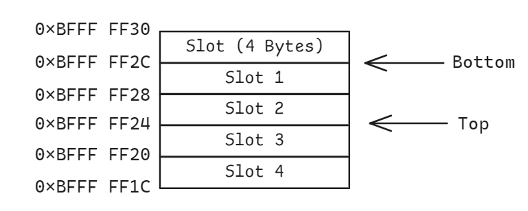
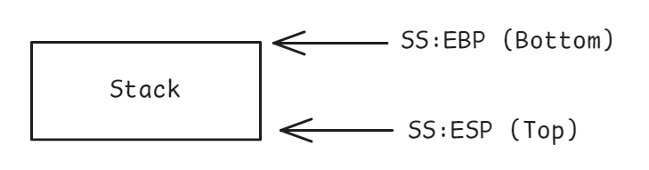

# Stack

The Linux kernel allocates a virtual memory space for each process to ensure isolation, flexibility, and efficient memory management. In a 32-bit system, this virtual memory is divided into distinct sections, each serving a specific purpose:

- **Text Segment**: Contains the program's executable code.

- **Data Segment**: Stores global and static variables.

- **Heap**: Manages dynamically allocated memory using functions like `malloc()` and `free()`.

- **Stack Segment**: Handles function calls, local variables, and maintains the program's execution flow.

The layout in 64-bit systems is similar, but with a significantly larger address space. Later, we will focus on the Stack Segment.

## Stack layout

The stack segment is a memory structure that follows a **last-in-first-out (LIFO)** order, where data is added to and removed from the "top" of the stack.



In 32-bit x86 architectures, the stack is divided into basic units called slots, each 4 bytes in size. 




On 64-bit x86-64 architectures, the slot size is expanded to 8 bytes to accommodate the larger word size.


## Stack Operations

Stack operations rely on specific registers to function effectively:

- **Stack Segment (SS)**: Holds the base address of the stack segment.

- **Stack Pointer (ESP/RSP)**: Points to the current top of the stack in memory.

- **Base Pointer (EBP/RBP)**: Points to the bottom of the current stack frame (commonly referred to as the Frame Pointer). It is often used to reference function parameters and local variables within the stack frame.




### Push Operation

Data is stored on the stack by "pushing" it. This decreases the stack pointer and writes the data to the new location.

```asm
; Example:
push 10

; Assembly equivalent:
sub esp, 4                  ; Decrease stack pointer by 4 bytes
mov dword ptr [esp], 10     ; Store the value 10 at the new top of the stack
```

### Pop Operation

Data is retrieved from the stack by "popping" it. This reads the value at the top of the stack and then increases the stack pointer.

```asm
; Example:
pop eax

; Assembly equivalent:
mov eax, [esp]              ; Retrieve the value at the top of the stack into EAX
add esp, 4                  ; Increase the stack pointer by 4 bytes
```

### Call

The CALL instruction transfers control to a subroutine while saving the return address onto the stack.

```asm
; Example:
call [subroutine]

; Equivalent assembly:
push [address of next instruction]  ; Save return address
jmp [subroutine]                    ; Jump to the subroutine
```


### Return (RET)

The RET instruction is used to return from a subroutine. It retrieves the return address from the stack and transfers control back to it.

```asm
; Example:
RET

; Equivalent assembly:
pop eip                     ; Restore the saved return address into the instruction pointer (EIP)
```

### Leave

The LEAVE instruction cleans up the current stack frame by restoring the base pointer and stack pointer to their original state.

```asm
; Example:
leave

; Equivalent assembly:
mov esp, ebp                ; Restore the stack pointer (ESP) to the base pointer (EBP)
pop ebp                     ; Restore the previous base pointer value
```
