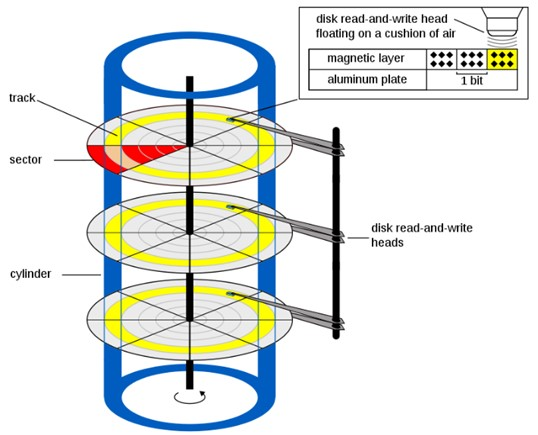
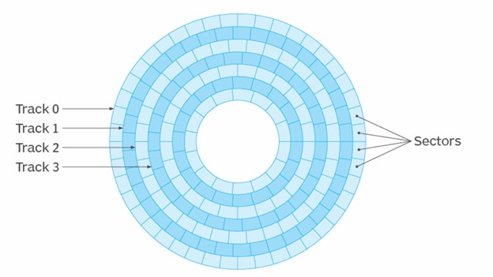

# Storage Device addressing

Efficient data retrieval is crucial for system performance and reliability. **Cylinder-Head-Sector (CHS)** and **Logical Block Addressing (LBA)** are two fundamental methods for addressing data on storage devices.


## Cylinder-head-sector (CHS)

CHS addressing is an early method used to locate data on disk storage systems. It organizes data by specifying three coordinates:

- **Cylinder**: Represents the vertical position on the disk, ranging from 0 to 1023.
- **Head**: Refers to the specific disk surface or platter, ranging from 0 to 254.
- **Sector**: Denotes a specific segment of data within a track, ranging from 1 to 63.

Each sector is 512 bytes in size, so the maximum disk capacity addressable by CHS is approximately 8 gigabytes. This is calculated as 1024 * 255 * 63 * 512 bytes, which equals about 7.8433 GB.

Although CHS addressing was widely used in earlier disk drives, it is now largely obsolete due to its limitations in addressing larger storage capacities and more complex configurations. 



## Logical Block Addressing (LBA)

LBA is a modern and widely used method for locating data on storage devices. It simplifies data access by assigning a unique number to each data block or sector in a continuous address space, rather than using multiple coordinates. 

LBA provides a straightforward, flat addressing scheme where each sector or block has a unique address, and it supports larger disk sizes and more partitions, overcoming the limitations of CHS.

LBA has evolved through various standards:

- **22-bit LBA**: Introduced in the early 1990s as part of the IDE standard, supporting ATA/IDE drives with a maximum addressable capacity of around 8.4 GB.
- **28-bit LBA**: Incorporated into the ATA-1 standard in 1994, allowing for the mapping of CHS addresses and supporting larger drives up to 137 GB.
- **48-bit LBA**: Available since the release of ATA-6 in 2003, extending the address space to support drives larger than 137 GB, up to 128 PB (petabytes).

Overall, LBA provides enhanced efficiency and flexibility for modern storage systems, making it the preferred method for addressing data in contemporary hard drives, SSDs, and other storage devices.



<br>
<br>

# AT Attachment (ATA)

**ATA**, also known as **IDE (Integrated Drive Electronics)**, is a standard interface used to connect storage devices like hard drives and optical drives to a computer's motherboard. 

ATA integrates the drive controller within the storage device itself, whether it is a **parallel ATA (PATA)** or **serial ATA (SATA)** drive. This integration allows the drive to handle data read/write operations internally and communicate with the motherboard using the ATA standard interface.

## Access ATA Disk using the BIOS

The BIOS provides a set of disk access routines using the **INT 0x13** family of BIOS functions. Until an appropriate driver is implemented, these BIOS functions are the only way to access disks.

INT 0x13 provides various disk services. To load content from disk into memory, you can use the service **"INT 13h AH=42h"** for extended read operations.

### Service "INT 13h AH=42h" Usage

| | Register | Description |
| -------- | :--------: | -------- |
| **INPUT**| AH   | function number (42h)  |
| | DL   | drive index (e.g. 1st HDD = 80h)   |
| | DS:SI   | segment:offset pointer to the DAP   |
| **OUTPUT**| CF   | set on error, clear if no error  |
| | AH   | return code   |

**Disk Address Packet (DAP)** is a data structure used to define disk operations, such as reading from or writing to a disk. The layout of the DAP is as follows:

| Offset | Size | Description |
| -------- | -------- | -------- |
| 0 | 1 byte | size of DAP (set this to 10h) |
| 1 | 1 byte | unused, should be zero |
| 2-3 | 2 byte | number of sectors to be read or written |
| 4-7  | 4 byte | segment:offset pointer to the memory buffer |
| 8-F | 8 byte | absolute starting LBA address of the sectors to be accessed |


## Example

```nasm
;=========================================================================
; Constant Declaration
;-------------------------------------------------------------------------

SETUP_ADDR_BASE     equ     0x500
SETUP_SECTOR_START  equ     1	
SETUP_SECTOR_COUNT  equ     2

;=========================================================================
; Read content from Storage Device to memory 
;-------------------------------------------------------------------------

    mov si, dap
    mov ah, 0x42
    mov dl, 0x80
    int 0x13

    jc .read_hd_failure

;=========================================================================
; Construct DAP
;-------------------------------------------------------------------------

dap:
    db 0x10
    db 0
    dw SETUP_SECTOR_COUNT
    dd SETUP_ADDR_BASE
    dq SETUP_SECTOR_START
```

Reference: https://en.wikipedia.org/wiki/INT_13H
